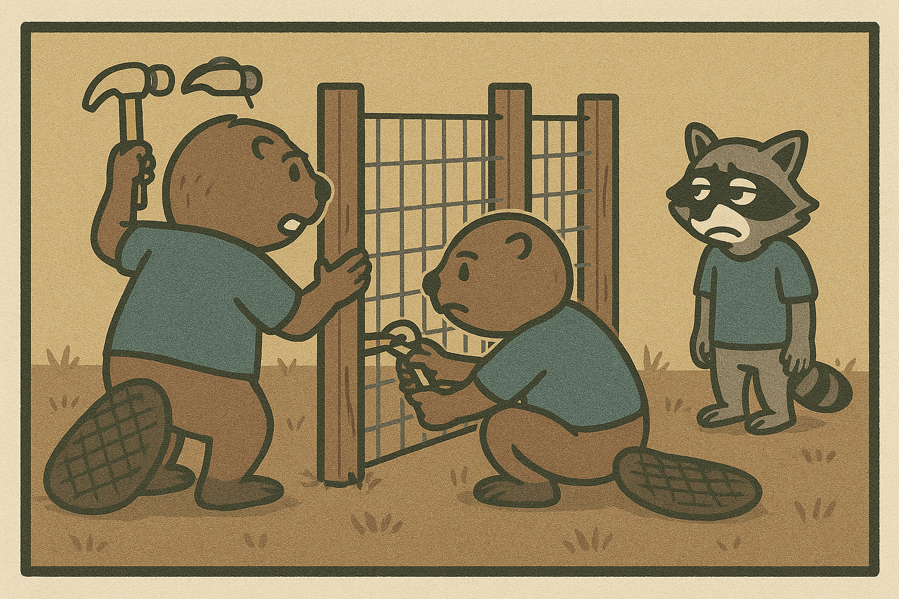

# Access Denied? Not Quite

A raccoon named Riley bypasses every "keep out" sign because the app forgot to lock the doors - an A01:2021 Broken Access Control fable.

## Scene 1 - The Unlocked Gate

Riley bookmarks an admin URL shared in a forum. No login is required, and the server never checks her role.

**Lesson:** Every sensitive endpoint must enforce authorization on the server. URLs are not secrets.

## Scene 2 - Parameter Party

She swaps `orderId=123` for `orderId=122` and views another user's order details. Classic IDOR (Insecure Direct Object Reference).

**Lesson:** Enforce object-level authorization. Don't trust user-controlled identifiers.

## Scene 3 - Method Mischief

Riley edits a network request from `GET /api/orders/123` to `DELETE /api/orders/123`. The API happily complies - no checks for verb + role.

**Lesson:** Authorize the action, not just the route. Validate HTTP methods against permissions.

## Scene 4 - Fixing the Fence

The team patches the gaps:

- Enforce authz on every sensitive route server-side
- Implement object-level checks for resource ownership
- Use deny-by-default policies and least privilege
- Log and alert on denied attempts

**Lesson:** Assume curious critters will try every door. Make sure each one is locked and monitored.

## Checklist

- Server-side authz on all sensitive endpoints
- Object-level checks for ownership/tenancy
- Deny-by-default policies; least privilege roles
- Protect method/verb misuse
- Audit logs for access denials and anomalies
