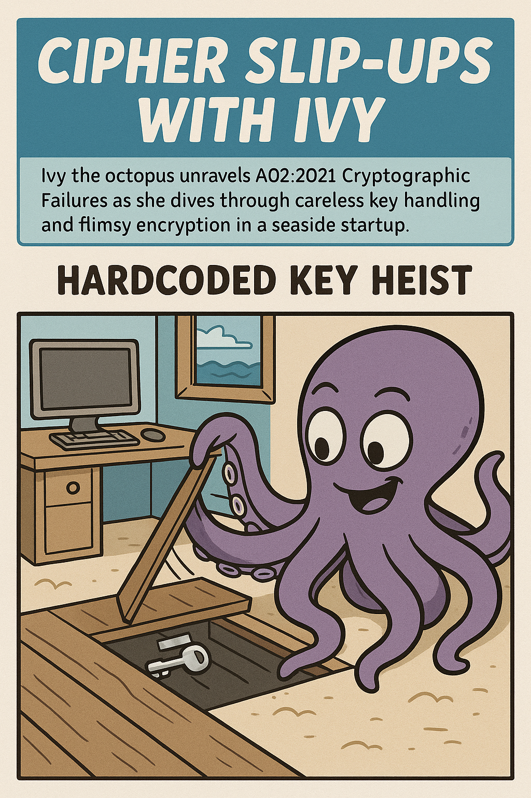
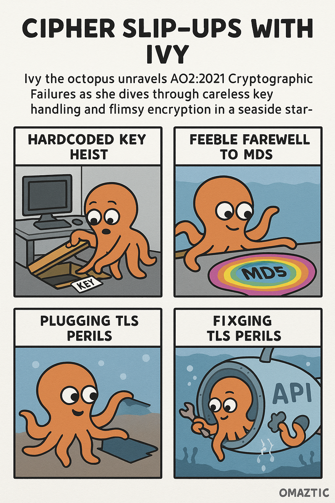
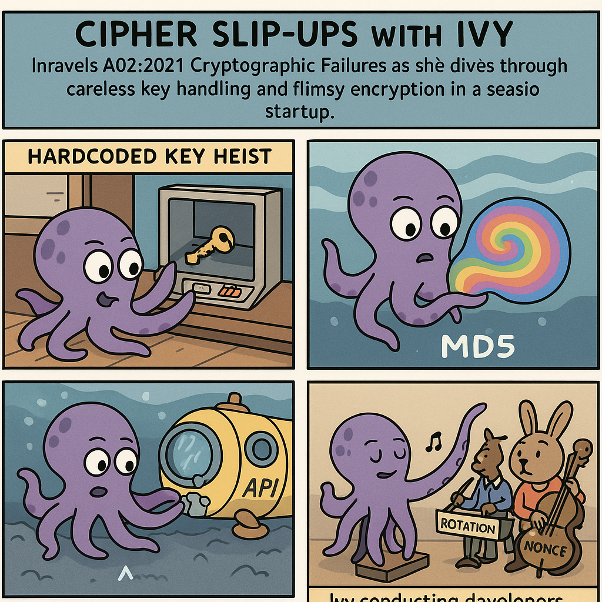

# Cipher Slip-Ups with Ivy

Ivy the octopus unravels A02:2021 Cryptographic Failures as she dives through careless key handling and flimsy encryption in a seaside startup.

## Scene 1 - Hardcoded Key Heist

A teammate DMs Ivy the "secret" AES key: it has been hardcoded in the mobile app for months, so attackers pull it straight from the binary.

**Lesson:** Never embed crypto keys in code or repos; store them in managed vaults with rotation.

## Scene 2 - Weak Hash Whirlpool

Customer passwords are hashed with bare MD5, letting a rainbow-table whirlpool spit out real credentials in minutes.

**Lesson:** Use modern password hashing (bcrypt, scrypt, Argon2) with per-user salts and tuned cost factors.

## Scene 3 - TLS Gap in the Hull

Internal APIs still use HTTP with self-signed certs, so session tokens can be sniffed by anyone on the coffee-shop Wi-Fi.

**Lesson:** Enforce TLS 1.2+ everywhere, validate certs, and enable HSTS to block downgrade attacks.

## Scene 4 - Crypto Tune-Up

The team patches the biggest leaks: move secrets into the KMS, upgrade to AES-GCM with fresh nonces, and roll out automated cert renewal.

**Lesson:** Centralize key management and review crypto configs regularly to avoid silent regressions.

## Checklist

- Store keys and secrets in a vault or KMS with rotation
- Prefer authenticated encryption modes with unique IVs
- Hash passwords with bcrypt/scrypt/Argon2 and salts
- Enforce TLS 1.2+ end-to-end with cert validation and pinning
- Monitor crypto libraries/configs for regressions during releases
