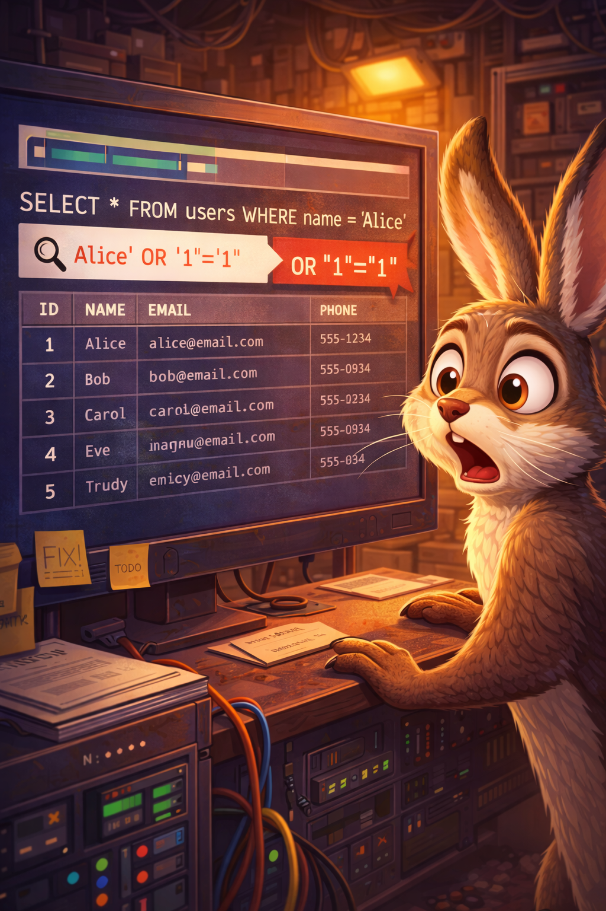
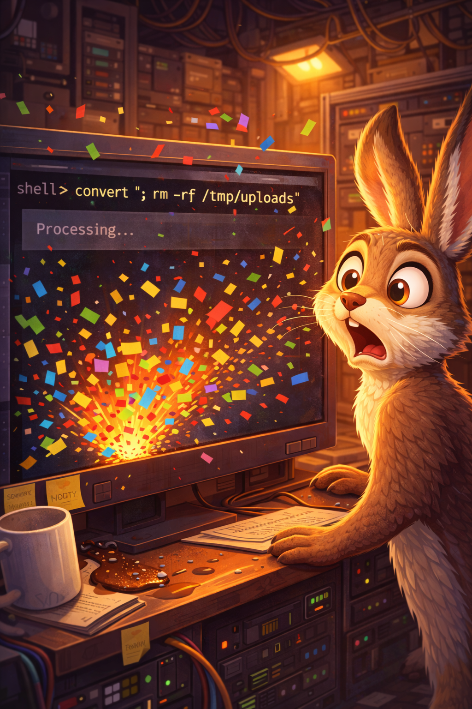
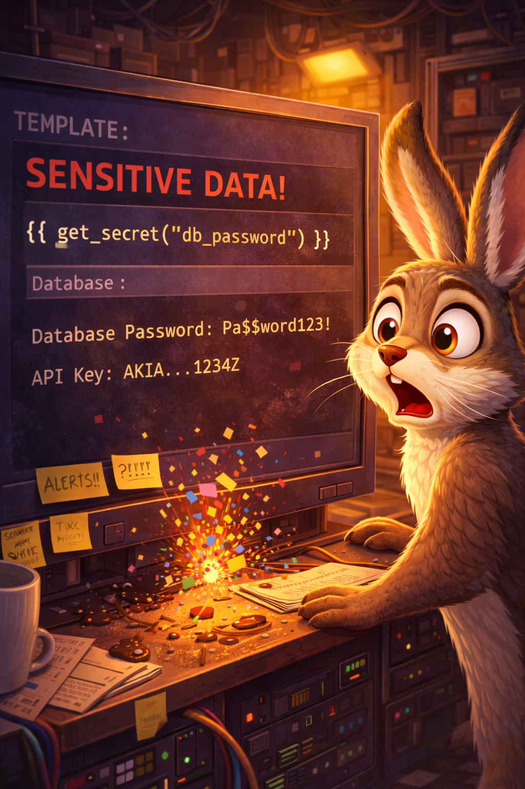

# Injection Junction

Jax the jackrabbit learns how a little untrusted input can steer an app straight into danger.

## Scene 1 - The String That Got Away

Jax builds a quick search feature by concatenating user input into a SQL query. A curious user adds `' OR '1'='1` and suddenly sees every record.

**Lesson:** Never build queries with string concatenation. Use parameterized queries or prepared statements.

## Scene 2 - Command Confetti

The app shells out to `convert` with user-provided filenames. An attacker adds `; rm -rf /tmp/uploads` and the server happily runs it.

**Lesson:** Avoid shelling out with raw input. If you must, use safe APIs and strict allowlists.

## Scene 3 - Template Trap

A templating feature renders user-supplied templates in production. A malicious template reads secrets and leaks them out.

**Lesson:** Treat templates and interpreters as code execution. Sandbox or disable user-authored templates.

## Scene 4 - The Safe Route

The team fixes the path:

- Use parameterized queries for all data access
- Validate and sanitize input with allowlists
- Avoid dangerous interpreters in production
- Add logging and WAF rules for suspicious patterns

**Lesson:** Injection is a design flaw, not just bad input. Build with safe primitives.

## Checklist

- Parameterized queries everywhere
- Input allowlists and context-aware encoding
- Avoid shell execution and unsafe interpreters
- Centralize validation helpers
- Monitor logs for injection attempts
