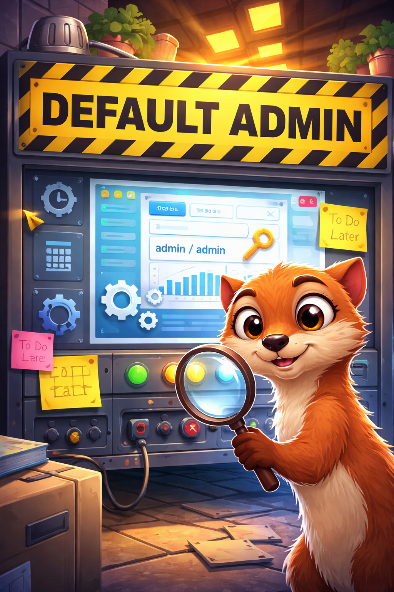
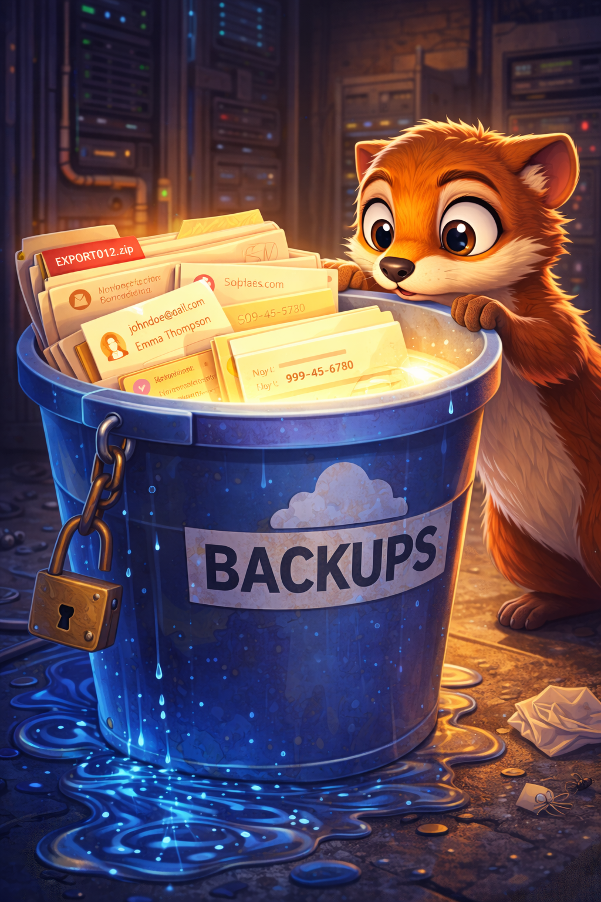
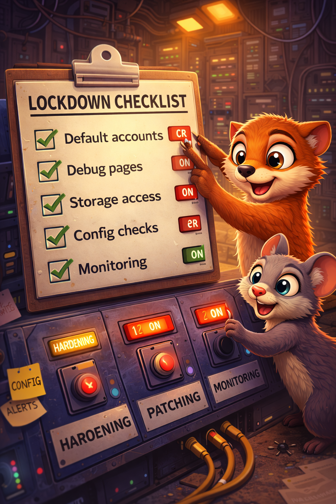

# The Misconfig Maze

Mara the mongoose discovers how a few "temporary" settings can turn a simple app into an open house.

## Scene 1 - Default Doorways

Mara finds a staging admin panel still running with default credentials. The team meant to lock it later, but "later" never came.

**Lesson:** Defaults are for demos. Change them before anything goes live.

## Scene 2 - Debug Spill

A crash shows full stack traces and environment details in production. Mara now knows framework versions, paths, and secrets.

**Lesson:** Disable debug modes and limit error details in production.

## Scene 3 - Open Storage

A cloud bucket has public read access. Old customer exports are one link away from being indexed.

**Lesson:** Treat storage like a locked room: restrict access, verify policies, and audit regularly.

## Scene 4 - Lockdown Checklist

The team hardens their setup:

- Remove default accounts and credentials
- Turn off debug and verbose error pages
- Restrict storage and network access by default
- Automate config checks and alert on drift

**Lesson:** Misconfigurations are preventable when you make safe defaults and continuous checks a habit.

## Checklist

- Change default creds and sample configs
- Disable debug features in production
- Lock down storage, ports, and admin panels
- Automate config reviews and drift alerts
