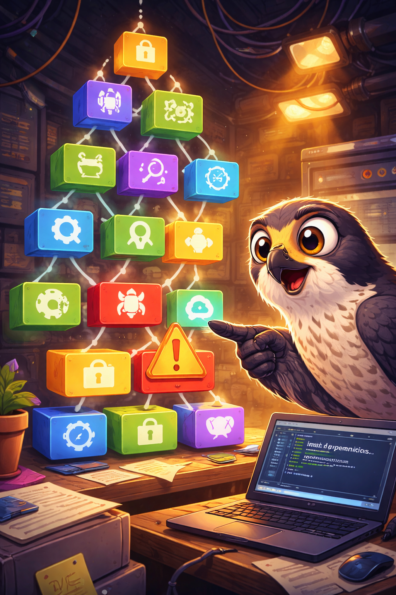
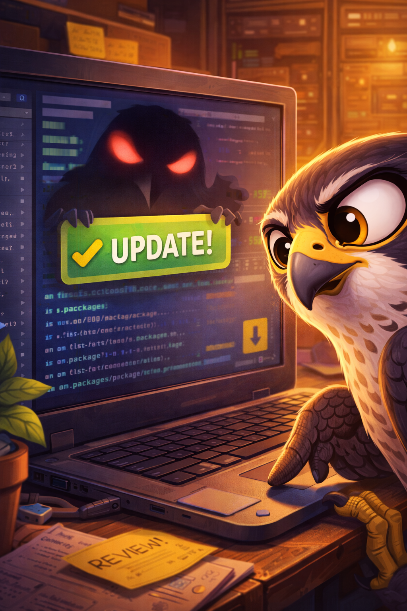
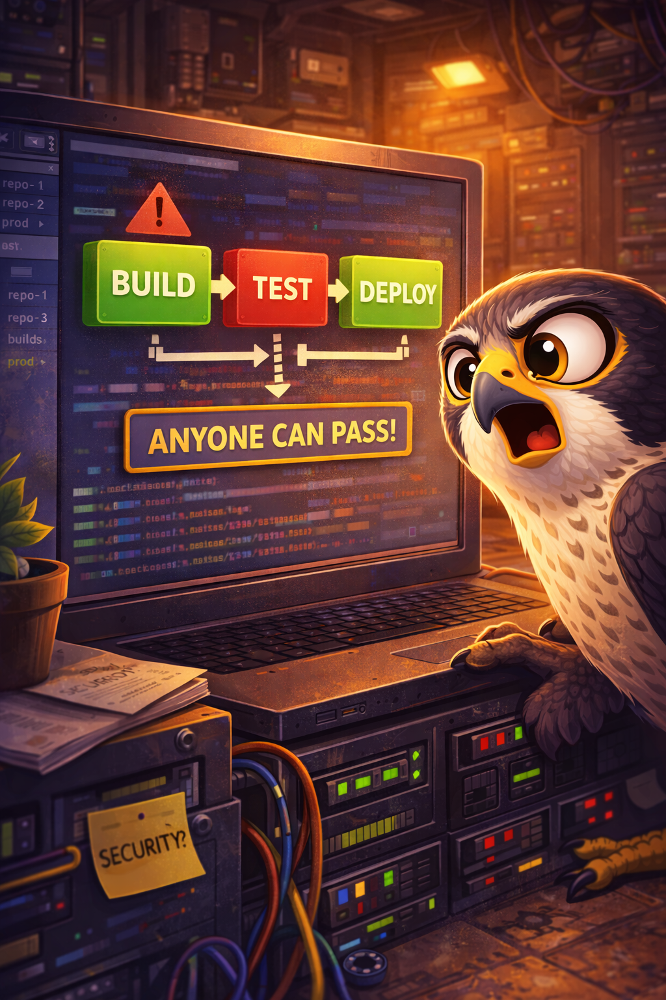
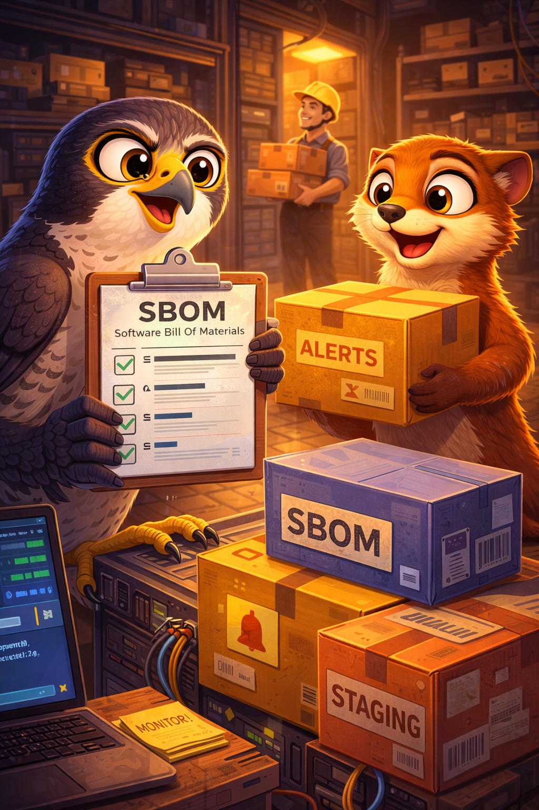

# The Dependency Dominoes

Pip the peregrine learns how tiny, hidden changes in the supply chain can topple an entire app.

## Scene 1 - The Unknown Package

Pip adds a small helper library without tracking its transitive dependencies. One of those packages is outdated and vulnerable.

**Lesson:** Track direct and transitive dependencies, and keep them updated.

## Scene 2 - The Silent Swap

A trusted package update arrives, but it contains a malicious change. The build system pulls it automatically.

**Lesson:** Use trusted sources, prefer signed packages, and review changes before upgrading.

## Scene 3 - CI/CD Shortcut

The pipeline runs with broad permissions and no change tracking, so a bad update moves from repo to prod without a second set of eyes.

**Lesson:** Harden CI/CD, require reviews, and track changes across the supply chain.

## Scene 4 - Supply Chain Tune-Up

The team puts guardrails in place:

- Generate and manage an SBOM for all components
- Continuously inventory versions and monitor CVE sources
- Remove unused dependencies and features
- Use staged rollouts for updates

**Lesson:** Supply chain safety is ongoing: inventory, monitor, and harden every step.

## Checklist

- SBOM for all components and dependencies
- Continuous vulnerability monitoring and alerting
- Trusted sources and signed packages
- Hardened CI/CD with change tracking and reviews
- Staged rollouts for updates
