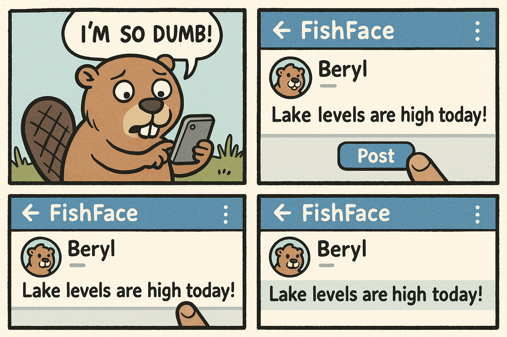
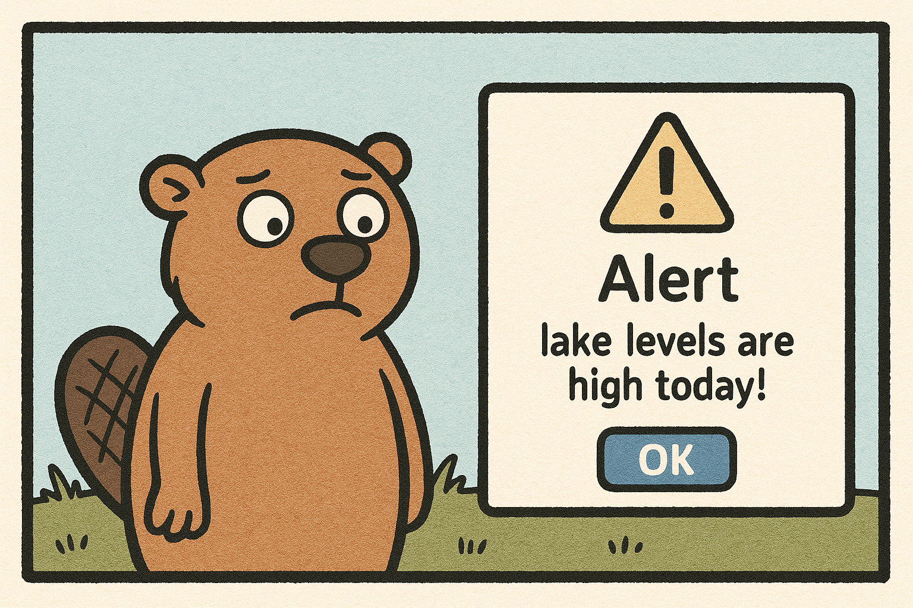
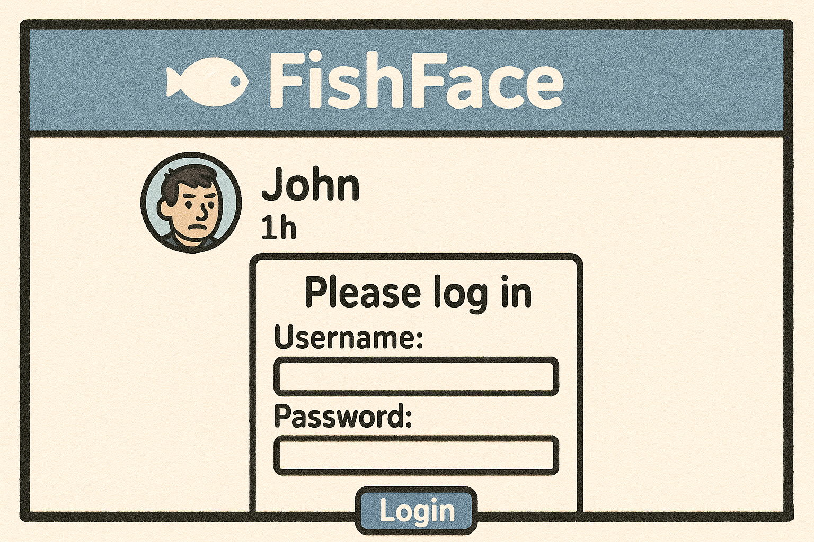
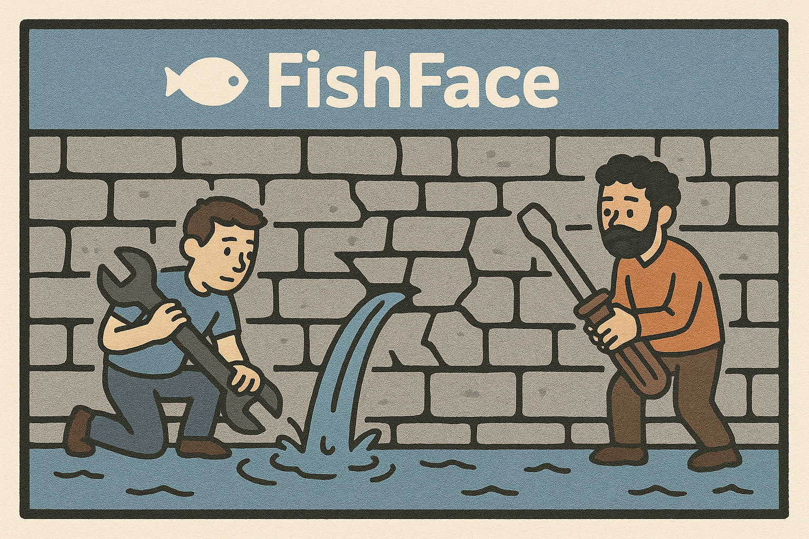

# FishFace XSS Fiasco

A careless beaver named Beryl just wanted to check her FishFace feed - then she turned herself into an XSS cautionary tale.

## Scene 1 - Hungry for Likes

Beryl opens FishFace and types:  
`Just chewed through 3 trees `.  
She thinks the tags make her post look fancy. The app reflects input straight back into the timeline - no sanitization, no encoding.

**Lesson:** Untrusted input needs to be escaped or sanitized before rendering. Fancy brackets are not decorations.

## Scene 2 - Beaver Becomes the Bug

Every user (including Beryl) now sees an alert when viewing the feed. A harmless payload today; credential-stealing tomorrow.

**Lesson:** Context matters. HTML, attribute, and script contexts each need the right kind of encoding.

## Scene 3 - Mischief Escalates

An attacker copies Beryl's trick and injects a fake login form that posts credentials off-site. Users submit it because it looks native.

**Lesson:** Treat reflected and stored XSS as critical. Validate input, encode output, and use Content Security Policy (CSP) defense-in-depth.

## Scene 4 - Fixing the Dam

The FishFace team ships fixes:

- Encodes user-generated content for the HTML context
- Strips dangerous tags/attributes on rich text
- Enables a strict CSP (default-src 'self'; script-src 'self')
- Adds output encoding helpers to the component library

**Lesson:** Centralize safe rendering utilities so developers don't reinvent escaping.

## Quick Checklist

- Encode output for the correct context (HTML/attr/JS/URL)
- Prefer vetted sanitizers for rich text
- Use CSP as a backstop, not a bandage
- Keep security reviews in the dev loop - don't ship like Beryl
